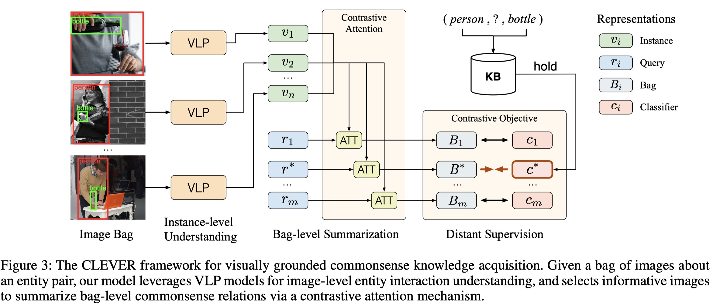

# Visually Grounded Commonsense Knowledge Acquisition

The code and datasets of our AAAI 2023 paper [Visually Grounded Commonsense Knowledge Acquisition](https://not_available_yet).

## Overview



In this work, we propose to formulate Commonsense Knowledge Extraction (CKE) as a distantly supervised multi-instance learning problem and present a dedicated CKE framework CLEVER that integrate VLP models with contrastive attention to deal with complex commonsense relation learning. You can find more details in our [paper](https://not_available_yet).


## Installation

Check [INSTALL.md](INSTALL.md) for installation instructions.

## Data Preparation

Check [DATASET.md](DATASET.md) for data preparation.

## Training

```sh
# Prepare dataset according to 'Data Preparation' Section

cd src/Oscar
bash train.sh
```

## Baselines

### Text-based Baselines

We directly use [RTP](https://nlp.stanford.edu/software/scenegraph-parser.shtml) to extract triplets from [Conceptual Captions](https://github.com/google-research-datasets/conceptual-captions) which contains more than 3 millon image captions. Triplets are sorted by frequency for evaluation.

### PLM-based Baselines

```sh
# Vanilla-FT
cd src
python vanilla_ft.py

# LAMA and Prompt-FT
cd src
python prompt_ft.py
```

## Citation

Please consider citing this paper if you use the code:

```bib
@inproceedings{yao2023clever,
  title={Visually Grounded Commonsense Knowledge Acquisition},
  author={Yao, Yuan and Yu, Tianyu and Zhang, Ao and Li, Mengdi and Xie, Ruobing and Weber, Cornelius and Liu, Zhiyuan and Zheng, Haitao and Wermter, Stefan and Chua, Tat-Seng and Sun, Maosong},
  booktitle={Proceedings of AAAI},
  year={2023}
}
```

## License

CLEVER is released under the MIT license. See [LICENSE](LICENSE) for details.

## Acknowledge

Our implementation is based on the fantastic code of [Oscar](https://github.com/microsoft/Oscar).
